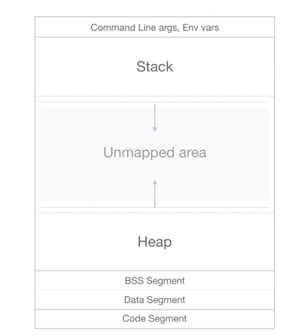

# Notes from [Essentials of Garbage Collection](https://dmitrysoshnikov.teachable.com/courses/607252/)

## Memory Management

### 1. Allocation Types
1. 3 types of allocation types:
   1. __Static__
      1. All sizes are known at compile time.
      2. Most robust.
      3. Can't deal with:
         1. Recursion
         2. Variable sized data structures.
   2. __Stack__
      1. Allows recursion.
      2. Stack frames or activation records allow for users to pass in parameters to functions.
      3. Can't deal with:
         1. Runtime dynamic allocations.
         2. Stack overflow => robustness decreases.
   3. __Heap__
      1. Dynamic memory. 
      2. Any chunk of memory and pointer can be returned. 
      3. Variable sized data structures are allowed.
      4. As a developer, we need to deal with memory management:
         1. Memory Leaks
         2. Dangling pointers.

### 2. Manual Memory Management
1. __Memory Leak__
   1. Forgetting to free memory and as a result, the allocation is still on the heap but we have no way to free that memory up.
2. __Dangling Pointer__
   1. Freeing memory too early and as a result, a pointer pointing to invalid memory.
      1. ```free(ptr); *ptr = x;```
3. Reason for these issues with manual memory management is human error and as a result Automated Memory Management is done to reduce human factor of error.

### 3. Object Header
1. Stores metadata used by the allocator and/or collector.
2. Any automation comes with a price and the object header contains vital information that speeds up the allocation / collection aspect of GC. 
3. Typical allocation
   1. Object Header (N bytes)
   2. User Data (Requested bytes)
   3. Padding / Word Alignment
4. Object header can be co-located with the user data or be available elsewhere.

### 4. Virtual Memory and Memory Layout
1. OS allocates virtual memory space for a particular process. The amount allocated is limited by the size of the word. 
   1. e.g. 32 bit systems => 4 GB per process.
   2. For Linux:
      1. 1 GB reserved for the OS.
      2. 3 GB for the user space.
   3. For Windows:
      1. 2 GB for the OS (can be changed).
      2. 2 GB for the user space.
2. Layout
   1. 
   2. Regions
      1. __Code Segment__: Executable code containing instructions stored in the binary.
      2. __Data Segments__: Contains data e.g. static data.
         1. __BSS Segment__: Uninitialized data.
         2. __Data Segment__: Initialized data.
      3. __Stack__:
         1. Grows down from upper to lower addresses.
         2. Base Pointer (``%rbp``) to Stack Pointer (``%esp`` / ``%rsp``).
         3. Limit pointer denotes maximum size the stack can grow to before stack overflows.
         4. OS introduces random offset for security.
      4. __Heap__: 
         1. Grows up from lower to upper addresses.
         2. Top of the heap is denoted by the ``brk`` or Program Break.
         3. More memory can be requested by bumping up the ``brk``.
            1. In Linux, this can be done via the following system calls:
               1. ``brk(void *addr)``.
               2. ``sbrk(intptr_t increment)``.
               3. ``mmap(...)``.
            2. These system calls are manipulated by the ``malloc(..)`` and ``free(..)`` functions.
      5.  __Memory Mapped Segments: Space Between Stack and Heap__
          1.  Files
          2.  I/O Devices
          3.  Heap Memory is reclaimed from this space.
      6.  __Command Line Args / Environment Variables__
3. __Memory Mapping Process__
   1. Virtual Memory pages are mapped to physical memory via __MMU__: Memory Management Unit. 
         1. __TLB__: Translation Look Aside Buffer, the cache of the virtual -> physical memory.
   2. If there is no physical memory available, the OS can use disk space: Swap Files in Unix and is transparent to the user.

### 5. Mutator, Allocator, Collector.
1. 3 Main Modules involved in Automatic Memory Management.
2. __Mutator__
   1. User program that creates object through the allocator.
   2. The Mutator doesn't directly manipulate the Heap.
3. __Allocator__
   1. Directly manipulates the heap by allocating the memory of the needed size requested by the mutator and tracks the meta-information or Object Header of the allocated objects.
   2. Result of the allocator is a pointer (or reference) to allocated memory block.
4. __Collector__
   1. Collector reclaims memory.
   2. Preserves Mutator view by preserving heap invariants such as not reclaiming live objects.
   3. Collector closely communicates with the allocator
      1. Synchronizing on the Object Header structure to update the metadata associated the allocations.
   4. Mutator may not know that the collector exists as it interacts primarily with the allocator.
   5. Some languages expose APIs to directly interact with the collecotr.
      1. ``System.gc()`` in Java.
      2. ``gc.collect()`` in Python.
5. __Stop The World__: The state the mutator is put in when the collector starts its work. All the threads are put to sleep for the process of collection to take place.
   1. There are improvements to this via ``Background GC`` that don't stop the world.

### 6. Allocators: Free-List vs. Sequential
1. __Sequential Allocator__
   1. The existing free blocks aren't used immediately but the allocation pointer i.e. where the next allocation will take place is simply increased and the garbage is left behind.
   2. Advantage of this allocator is that allocations are fast.
   3. Example: Pool Allocator.
   4. Used for:
      1. Mark-Compact
      2. Copying GC
      3. Generational GC
   5. Implementation is trivial, we just track the allocation and the end of the heap pointer.
2. __Free-List Allocator__
   1. A list like structure of free blocks i.e. blocks of memory on the heap where subsequent allocations can be made. The free list allocator reuses the freed block of memory, tracking them in a list-like data structure by traversing to find the memory of the appropriate size to use.
   2. This approach is a bit slower because of free-block searching overhead. 
   3. Used for:
      1. Mark-Sweep 
      2. Reference Count GC
   4. __Free List Search Strategies__
      1. __First-Fit__
         1. Finds the first block that fits the size starting from the beginning of the allocated blocks.
         2. If the find block found is larger, the block can be split tracking only the size that's needed.
      2. __Next-Fit__
         1. Variation of the first-fit but starts search from the previous successful position. This allows for skipping small blocks at the beginning of the heap to get the free block faster.
         2. If we reach the end of the heap, we start over from the start => "Circular first fit allocation"
      3. __Best-Fit__
         1. Finding blocks for which the size fits the best for the requested allocation.
         2. Doesn't split the block wasting resources and time.
      4. __Segregated Fit__
         1. Most optimized search algorithm used in production allocators.
         2. Heap is partitioned and grouped based on size e.g. Segregated List of Size 8, 16, 32, 64 etc.
         3. Multiple free lists containing blocks of a certain size.

### 7. Semantic vs. Syntactic Garbage
1. __Semantic Garbage__
   1. Data that will not be reached.
   2. Strong references to unused but live data aka "Live Garbage"
   3. Bugs in the program logic.
   4. Example: Non-Invalidated Caches.
2. __Syntactic Garbage__
   1. Data that cannot be reached. 
   2. Unreachable objects with no references to them.
   3. GC works only with syntactic garbage.