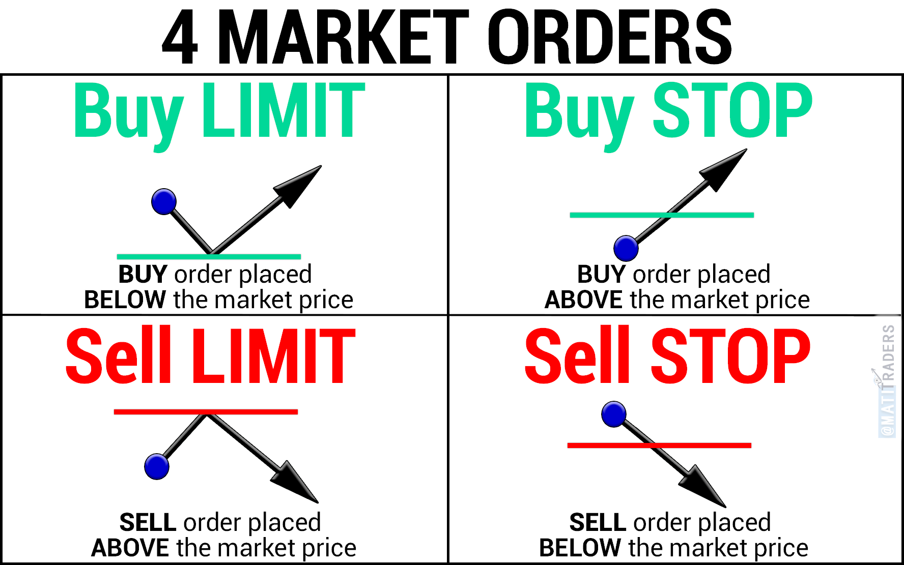

# Investment Strategies for a Volatile Market

## Diversification in a Volatile Market
1. Diversification: By investing in securities from a wide variety of asset classes, you can decrease risk and increase your returns at the same time.
   1. When you diversify, your investment portfolio is less volatile because losses in some investments are offset by gains from others.
2. No single type of investment outperforms all others in every type of economic situation.
3. Three ways to diversify:
   1. You can invest in different types of asset classes, such as stocks and bonds.
   2. You can diversify by investing in different types of industries or sectors. 
   3. You can invest in companies of varying sizes, such as small-cap and large-cap stocks.

## Tame Volatility with Limit Orders and Stop Orders
1. Picking the right type of order when you buy securities can greatly reduce your investment risk.
2. __Market order__ is executed immediately, and you accept the best price the market offers at that moment.
3. __Limit order__ can be used to specify the price at which you are willing to buy or sell your security instead of accepting whatever price the market gives you.
   1. It tells your broker to buy or sell a security, but not beyond a certain price.
   2. Sets a maximum buy or minimum sell order.
   3. A limit order does not guarantee that your request will be filled. 
   4. Limit orders are filled in the order in which they are placed.
      1. If there are other orders ahead of yours, stock prices could continue to rise or fall before yours is executed.
4. __Stop order__ is used when you are concerned that the market may move against you, then you can place a stop order with your broker to buy or sell securities when the market hits a trigger price.
   1.  A sell stop order is set at a price below the current market price.
   2.  A buy stop order is set above the current market price.
5.  How the Two Differ
    1.  
6.  Limit and stop orders have an expiration period.
7.  A good-'til-canceled order is good until the customer cancels it.

## Hedging to Curb Volatility
1. Hedging is the process of insuring an investment against risk.
2. All types of hedging attempt to gain profits regardless of overall market changes.
3. Successful hedging brings in healthy returns whether a security rises, falls, or stays the same.
4. The main goal of hedging is to reduce the volatility of an investment by offsetting its risk of loss.
5. Many hedging strategies involve the use of derivatives.
6. Other hedging techniques involve moving your investments around into different assets as markets change, and borrowing money off one investment to make another. Stocks, bonds, commodities, and even currency can be hedged.

## Buying On Leverage
1. Buying more assets with borrowed money or securities is known as leveraging.
2. To leverage, you need a margin account.
3. When you buy securities on margin, you borrow money from your broker by using your current shares as collateral.
   1. This reduces the amount of cash you have to pay up front, allowing you to buy more securities at rising prices. 
4. The risk is that the value of your margin securities will become worth less than your loan balance.
5. Leveraging is risky.

## Selling Short to Take Advantage of a Down Market
1. Selling short is the opposite of buying low and selling high.
2. If you think a security’s price will fall in the future, you can borrow shares from a brokerage, sell them, and, hopefully, buy them back at a lower price than you sold them for.
3. You then return the shares to the brokerage, making a profit on the difference.
4. If the share price rises, you will have to buy them back at a higher price than you sold them for in order to pay back the brokerage, taking a loss.
5. Selling short is a way to profit from falling prices.

## Using Option Strategies
1. If you think the price of the security will go up, you buy a call option.
2. If you think the price will go down, you buy a put option.

## Straddling Uncertainty
1. Purchasing an equal number of put and call options on the same security at the same time is called straddling.
2. An investor may straddle if he or she feels the security is highly volatile, but is not sure which direction the security’s price will take.
3. Straddling creates a possibility for profit while protecting the investor against volatility risk.
4. A straddle’s potential loss is limited to the difference between the strike price of the call and that of the put.

## Capitalize on Future Price Movements
1. Futures are usually used for tangible goods, but they can also be used for stocks and bonds.
2. Futures are used to capitalize on future price movements. 