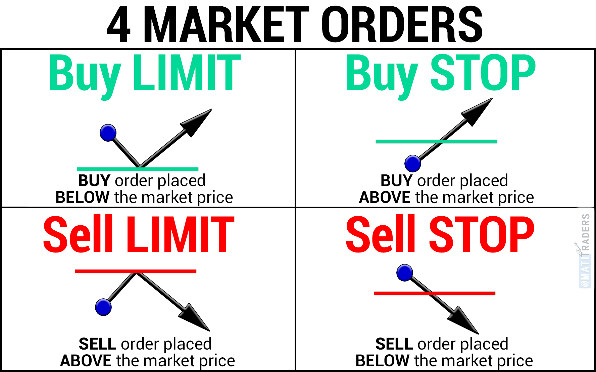

# [Morning Star Investor Classroom](https://www.morningstar.com/start-investing/classroom)

## Lessons

### [Stay invested in the market](1.StayInvestedInTheMarket.md)
1. Stay invested in the market.
2. Economies and markets move in cycles that are impossible to time.
3. Small and large stocks have historically provided the highest return.
4. Small stocks have historically, on average, outperformed the returns of large stocks after recessions.
5. It's important for an investor to stay disciplined and diversified.

### [Market Downturns and Recoveries](2.MarketDownturnsAndRecoveries.md)
1. The stock market moves in cycles with periods of contractions followed by expansion.
2. An investor should have a long-term time horizon to allow their assets to grow over time.
3. Stocks can lose their value suddenly.
4. Investors should have patience and should diversify to get the best trade offs of risk and return.

### [Introduction To Asset Classes And Downturns](3.IntroductiontoAssetClassesandDownturns.md)
1. Skillful use of balancing and correlation can reduce the risk of loss during a market downturn.
2. Different investments behave differently in different market conditions, though in rare cases they can behave contrary to how we would expect.
3. A balanced portfolio / All-Stock portfolio can weather the test of time over the long term.
4. The key is to be patient and not sell because of the fear of market downturns.

### [Risk And Volatility Data](4.RiskandVolatilityData.md)
1. Range of returns appears less volatile with longer holding periods as offsetting periods of positive returns vs. negative returns result in the dispersion of returns gravitating or converging toward the average.
2. Over the long term, stock investors have been rewarded for assuming this greater volatility of returns more than the bond investors.
3. Risk is measured by the standard deviation of annual returns.

### [Investment Strategies For A Volatile Market](5.InvestmentStrategiesforaVolatileMarket.md)
1. __Diversification__: By investing in securities from a wide variety of asset classes, you can decrease risk and increase your returns at the same time.
2. 2 types of orders:  
3. The main goal of hedging is to reduce the volatility of an investment by offsetting its risk of loss.
4. Buying more assets with borrowed money or securities is known as leveraging.
5. Selling short is the opposite of buying low and selling high where shares are borrowed to be sold.
6. Buy call options when stock price goes up and put options when prices go down.
7. Straddling involves buying both calls and puts and the potential loss is limited to the difference between the strike price of the call and that of the put.
8. Futures can be used to take advantage of future price movements.
   
### [Don't Focus Too Much on the Short Term](6.Don'tFocusTooMuchontheShortTerm.md)
1. Don't focus too much on the short term and rather, look at returns from a long term perspective.
2. Short-term market fluctuations can be quite volatile, and the probability of realizing a loss within any given day is high.

### [Dealing with Financial Stress](7.DealingwithFinancialStress.md)
1. Money is a very common source of stress.
2. Use techniques that help reduce the stress.